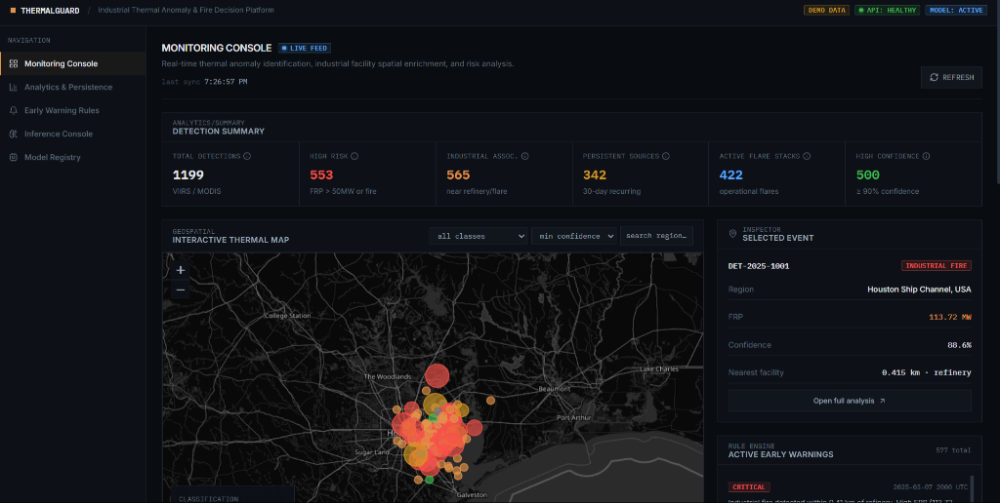
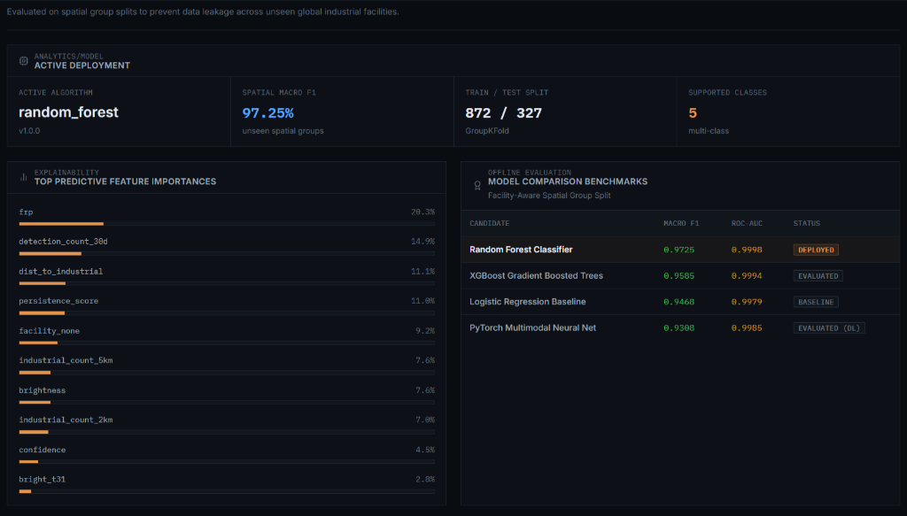
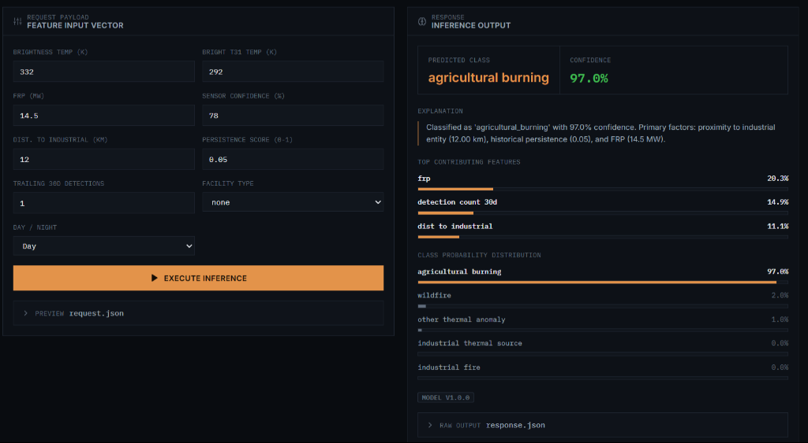

# AI Industrial Thermal Anomaly & Fire Monitoring System

An enterprise-grade, geospatial decision-support platform built to detect, classify, and monitor industrial fires, persistent thermal sources (refineries, flare stacks, gas terminals, chemical works), wildfires, and agricultural burnings using satellite imagery, NASA FIRMS thermal observations, and OpenStreetMap (OSM) spatial context.

---

## 📸 Key Application Interfaces

### 1. Geospatial Monitoring Console


> **Description**: The primary operational console provides real-time geospatial awareness with an interactive Leaflet dark-theme map. It overlays satellite thermal anomaly detections (MODIS / VIIRS), high-risk classification indicators, persistent operational flares, and regional cluster inspectors for immediate spatial context.

---

### 2. Active ML Deployment & Model Registry


> **Description**: Displays active machine learning model metrics evaluated on facility-aware **Spatial GroupKFold** splits to guarantee zero data leakage across geographically adjacent industrial hubs. Includes global feature importances (e.g., FRP, 30-day persistence, distance to industrial infrastructure) and real-time candidate model benchmark comparisons across Random Forest, XGBoost, PyTorch, and Logistic Regression.

---

### 3. Interactive ML Prediction Studio


> **Description**: An interactive inference sandbox allowing security analysts and domain engineers to input custom thermal observation parameters (Brightness Temp, FRP MW, proximity to industrial sites, persistence score). It executes real-time model inference, returning multi-class probability distributions, top contributing factors, and confidence attributions.

---

## 🏗️ System Architecture

```
                                 ┌─────────────────────────────────┐
                                 │      React 18 + Vite Dashboard   │
                                 │   Leaflet Map + Recharts Studio │
                                 └────────────────┬────────────────┘
                                                  │ REST API Call
                                                  ▼
                                 ┌─────────────────────────────────┐
                                 │       FastAPI Backend API       │
                                 │     (Uvicorn / Service Layer)    │
                                 └────────┬────────────────┬───────┘
                                          │                │
                    ┌─────────────────────┘                └─────────────────────┐
                    ▼                                                            ▼
    ┌──────────────────────────────┐                             ┌──────────────────────────────┐
    │  Thermal Detection Repo      │                             │   ML Model Inference Engine  │
    │  (Demo JSON / CSV Abstraction│                             │  (Random Forest / PyTorch)   │
    └──────────────────────────────┘                             └──────────────────────────────┘
```

---

## ⚡ How to Run Commands (Every Execution Method)

### Prerequisites
- **Python**: Version 3.10+ (Python 3.12 recommended)
- **Node.js**: Version 18+ (Node 22 recommended) with `npm`
- **Docker & Docker Compose**: Optional for containerized setup

---

### Method 1: Local Full-Stack Development Mode (Recommended)

#### Step 1: Install Dependencies

**Backend & ML Python Dependencies**:
```bash
# From repository root
pip install -r backend/requirements.txt
```

**Frontend Node Modules**:
```bash
cd frontend
npm install
cd ..
```

---

#### Step 2: Run ML Pipelines (Data Generation & Model Training)

Run the synthetic/demo data generator and train candidate ML models:

* **Linux / macOS**:
  ```bash
  # Generate demo observation data
  python3 ml/scripts/generate_demo_data.py

  # Train models and export best checkpoint to ml/models/best_model/
  PYTHONPATH=ml/src:backend python3 ml/scripts/train.py
  ```

* **Windows PowerShell**:
  ```powershell
  # Generate demo observation data
  python ml/scripts/generate_demo_data.py

  # Train models and export best checkpoint
  $env:PYTHONPATH="ml/src;backend"; python ml/scripts/train.py
  ```

---

#### Step 3: Start FastAPI Backend Server

* **Linux / macOS**:
  ```bash
  PYTHONPATH=backend:ml/src uvicorn app.main:app --host 0.0.0.0 --port 8000 --reload
  ```

* **Windows PowerShell**:
  ```powershell
  $env:PYTHONPATH="backend;ml/src"; python -m uvicorn app.main:app --host 0.0.0.0 --port 8000 --reload
  ```
> **Backend API URL**: `http://localhost:8000`  
> **Interactive Swagger Documentation**: `http://localhost:8000/docs`

---

#### Step 4: Start React + Vite Frontend Dashboard

In a new terminal window:
```bash
cd frontend
npm run dev
```
> **Frontend Web Dashboard**: `http://localhost:5173`

---

### Method 2: Containerized Deployment via Docker Compose

Spin up the entire stack (FastAPI Backend + React Frontend) inside Docker containers:

```bash
# Build and start container services in detached mode
docker-compose up --build -d

# View service logs
docker-compose logs -f

# Stop container services
docker-compose down
```
> Access Frontend at `http://localhost:5173` and Backend API at `http://localhost:8000`.

---

### Method 3: Running ML Pipelines & Benchmarks Independently

You can execute data processing and model evaluation standalone:

* **Generate Demo Dataset**:
  ```bash
  python ml/scripts/generate_demo_data.py
  ```

* **Train & Benchmark ML/DL Models**:
  ```bash
  # Windows PowerShell
  $env:PYTHONPATH="ml/src;backend"; python ml/scripts/train.py

  # Linux / macOS
  PYTHONPATH=ml/src:backend python3 ml/scripts/train.py
  ```

---

### Method 4: Running Automated Test Suites

* **Run ML Pipeline Unit & Integration Tests**:
  ```bash
  # Windows PowerShell
  $env:PYTHONPATH="ml/src;backend"; pytest ml/tests/

  # Linux / macOS
  PYTHONPATH=ml/src:backend pytest ml/tests/
  ```

* **Run Backend & E2E API Contract Tests**:
  ```bash
  # Windows PowerShell
  $env:PYTHONPATH="backend;ml/src"; pytest backend/tests/

  # Linux / macOS
  PYTHONPATH=backend:ml/src pytest backend/tests/
  ```

---

## 📡 API Endpoints Overview

| Endpoint | Method | Description |
|---|---|---|
| `/api/health` | `GET` | System health check, dataset mode (demo/live), and ML status |
| `/api/detections` | `GET` | Query satellite detections with pagination, confidence, FRP, and regional filters |
| `/api/detections/{id}` | `GET` | Retrieve single detection record with spatial OSM context and inference |
| `/api/predictions` | `POST` | Execute ML classification inference on custom feature input vector |
| `/api/analytics/summary` | `GET` | High-level metrics, total detections, high-risk counts, persistent sources |
| `/api/analytics/temporal` | `GET` | Daily temporal observation counts and average Fire Radiative Power (FRP) |
| `/api/analytics/classification` | `GET` | Multi-class distribution breakdown (industrial, flare, wildfire, agricultural) |
| `/api/analytics/regions` | `GET` | Regional thermal density metrics and facility risk indicators |
| `/api/analytics/persistence` | `GET` | Top 30-day persistent industrial flare stacks and recurring thermal sources |
| `/api/alerts` | `GET` | Automated early warning alert items generated by risk rule engine |
| `/api/models` | `GET` | Active model benchmarks, feature importances, and version metadata |

---

## 💡 Technical Distinctions & Methodology

- **What is Real**: Physics calculations ($T_{\text{diff}} = T_4 - T_{31}$), facility-aware spatial group splitting methodology (GroupKFold), trained Random Forest and PyTorch model weight artifacts, REST API contracts, and responsive dark-mode visualization system.
- **What is Demo Mode**: Simulated spatial observations centered around verified global industrial hubs (e.g., Permian Basin, Ruhr Valley, Houston Ship Channel, Jurong Island) utilized when live NASA/OSM API keys are omitted.
