# ThermalGuard — 24-Month FIRMS EDA Report (Real Data)

**Source file:** `data/processed/firms_noaa20_sp_bbox_68_8_97_37_2024-06-01_to_2026-05-31.csv`
**Script:** `ml/scripts/eda_firms_24mo.py` (re-runnable) | **Outputs:** `eda/outputs/`

## 1. Dataset audit (your §1 table, filled)

| Check | Result |
|---|---|
| Date range | 2024-06-01 → 2026-05-31 (min/max acq_date) |
| Total rows | 1,891,825 detections |
| Files | 146 raw 5-day CSVs merged (per validation report) |
| Sensor | NOAA-20 only (`N20` = 1,891,825; no S-NPP/NOAA-21 in this file) |
| Product | VIIRS SP (Standard; `product=VIIRS_NOAA20_SP`) — not NRT |
| Collection/version | `version=2` for all 1,891,825 rows (single version, no NRT/standard mixing) |
| Geographic coverage | India bbox 68,8,97,37; lat 8.00–37.00, lon 68.00–97.00; 0 outside bbox |
| Columns | latitude, longitude, bright_ti4, scan, track, acq_date, acq_time, satellite, instrument, confidence, version, bright_ti5, frp, daynight, type (+ source_file, data_source, product) |
| File duplicates | none (merged count == raw total per validation report) |
| Row duplicates | 0 exact; 1 event-key dup (lat/lon/date/time/sat/instr) — retained |
| Missing values | none in core fields (all missing % = 0) |
| Invalid coordinates | 0 bad lat, 0 bad lon |
| Invalid dates | 0 |
| Invalid FRP | 0 negative; min 0.0, max 1230.11 MW |
| Invalid brightness | ti4 207.9–367.0 K; ti5 242.4–380.8 K; ti4>ti5 in 99.87% rows |
| Confidence encoding | categorical `l/n/h` (l=322,406 / n=1,519,882 / h=49,537) — NOT numeric, NOT low/nominal/high strings |
| Day/night | `D`=1,357,525 / `N`=534,300 |
| Acquisition days | 730/730 expected days present — **0 missing days** |

## 2. Temporal (§7, §16, §17)

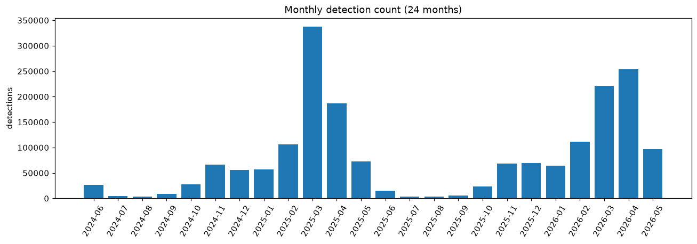
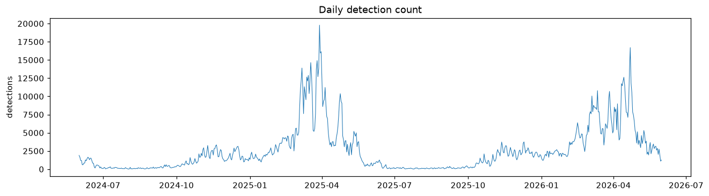
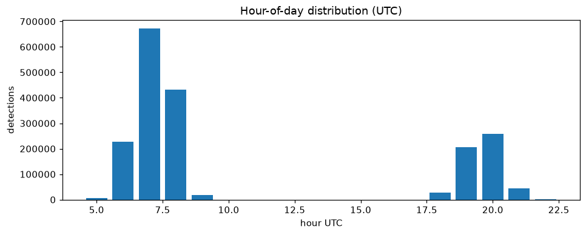
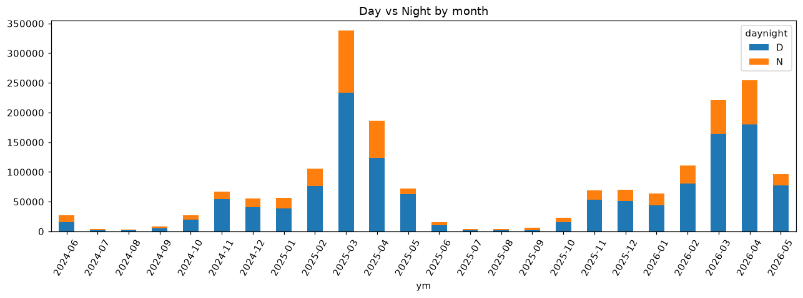

- Coverage is complete: every calendar day 2024-06-01…2026-05-31 has data (missing-day list empty).
- Strong seasonality: spring fire-season spikes (Mar–Apr 2025 and Mar–Apr 2026 dominate daily curve); monsoon trough Jun–Sep.
- `acq_time` is UTC — convert +5:30 for IST analysis.

## 3. Sensor / radiometry (§10–§15, §22–§24)

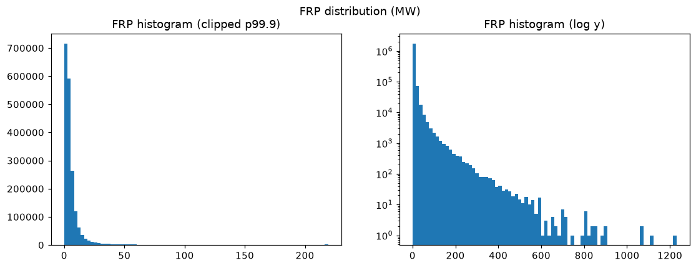
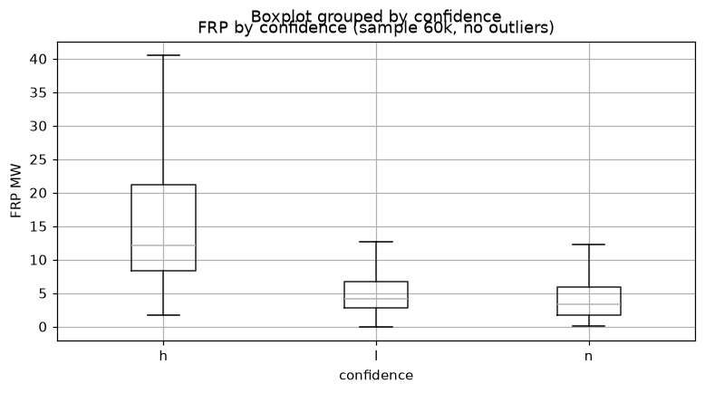
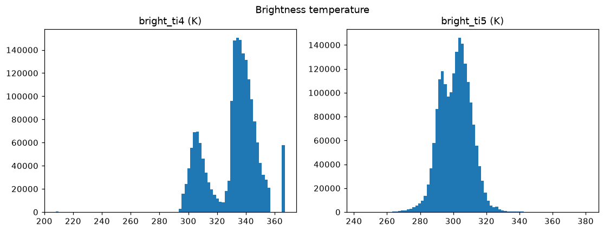
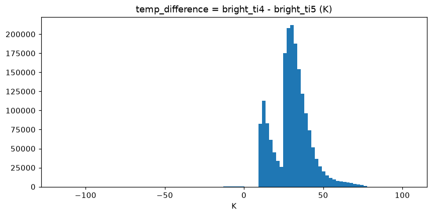
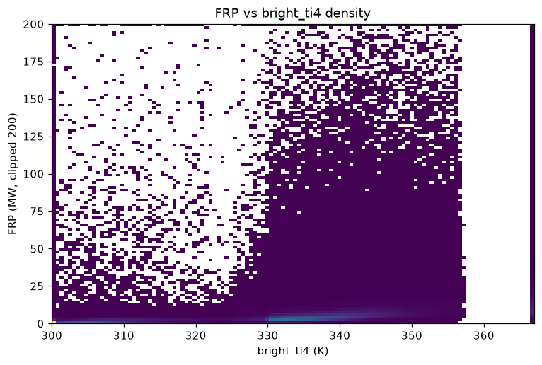
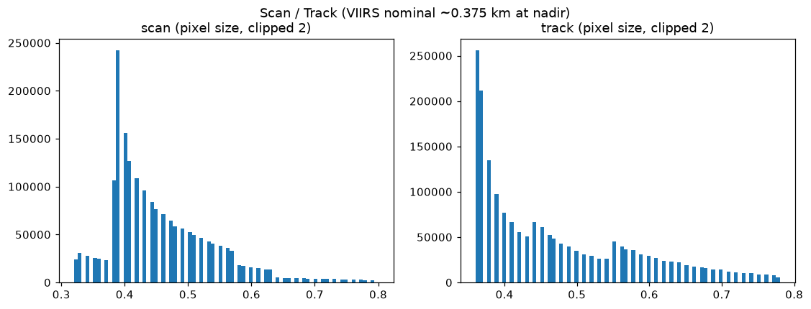
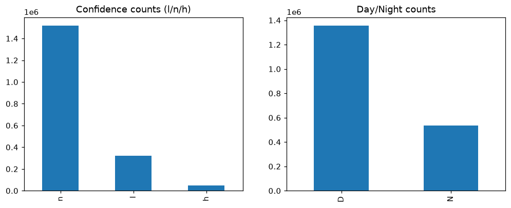

| Variable | min | median | mean | p99 | max |
|---|---|---|---|---|---|
| FRP (MW) | 0.0 | 3.59 | 6.55 | 59.44 | 1230.11 |
| bright_ti4 (K) | 207.9 | 335.2 | 331.5 | 367.0 | 367.0 |
| bright_ti5 (K) | 242.4 | 301.8 | 301.3 | 322.9 | 380.8 |
| temp_diff (K) | −117.0 | 30.34 | 30.24 | 65.24 | 104.5 |
| scan | 0.32 | 0.43 | 0.45 | 0.73 | 0.80 |
| track | 0.36 | 0.43 | 0.47 | 0.76 | 0.78 |

- FRP heavily right-skewed (mean ≫ median; p99 59 MW vs max 1230 MW) → use log scale / percentiles; **flag, don't delete** extremes (§22).
- temp_diff centered ~30 K, supports your existing feature; negative tail (−117 K) worth investigating, not dropping.
- scan/track cluster near nadir 0.32–0.5 with off-nadir tail to 0.8 — footprints are NOT uniform (§13).
- Correlations: ti4–ti5 0.73, ti4–temp_diff 0.84, FRP–ti4 0.27, FRP–lon 0.13 (full matrix in `outputs/correlations.csv`).

## 4. Geospatial (§5, §6, §18)

Pipeline: FIRMS 24-month observations → 2D spatial binning (120×120) → density heatmap → India administrative boundary overlay (Datameet country outline).

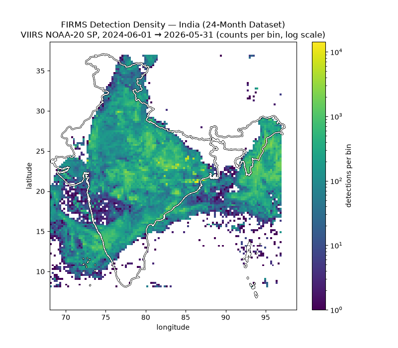
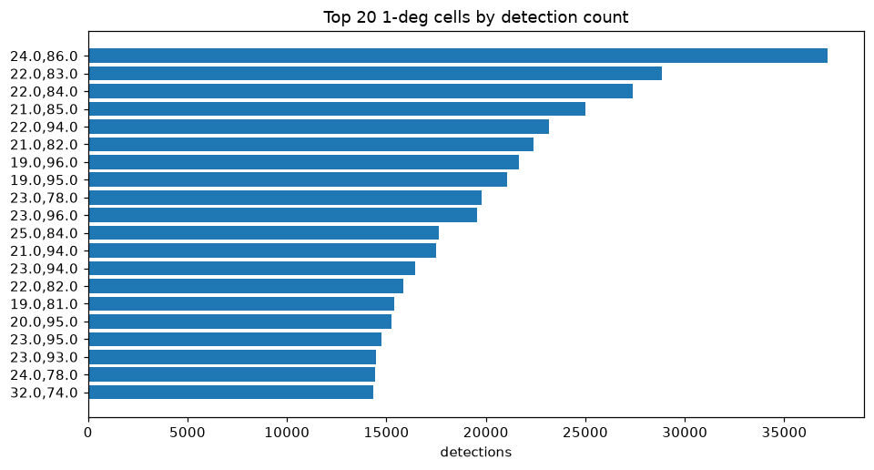

- **Detection-density map (counts per bin, NOT thermal intensity):** bright = many detections, dark = few. Title corrected accordingly.
- India boundary overlaid in black/white; bins outside the border (Pakistan/Nepal/Tibet/Bangladesh/Myanmar flanks, ocean) come from the bbox being wider than India — useful context, not an error.
- Concentrated belts need cross-checking against industrial corridors vs forest/agri zones before modelling (§6 warning against learning "Maharashtra = industrial fire").
- Top 1-deg cells (graph 13) — use for stratification, not as a label proxy.

### 4b. Thermal-intensity maps (FRP-weighted — separate from density)

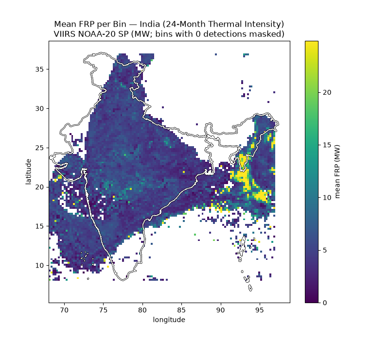
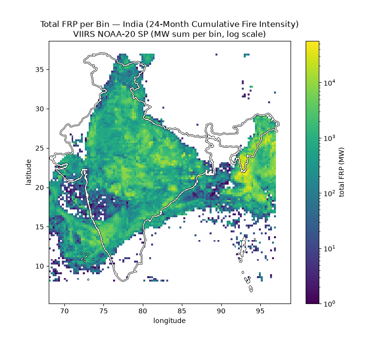

- **Mean FRP per bin** = thermal intensity: note NE India burns hotter per detection than the high-count central belt — density ≠ intensity.
- **Total FRP per bin** = cumulative fire load (MW sum, log scale).
- Boundary source: `eda/outputs/india_boundary_hr.geojson` (Datameet); simplified fallback `india_boundary.geojson`.

## 5. Data-quality extras (§3, §4)

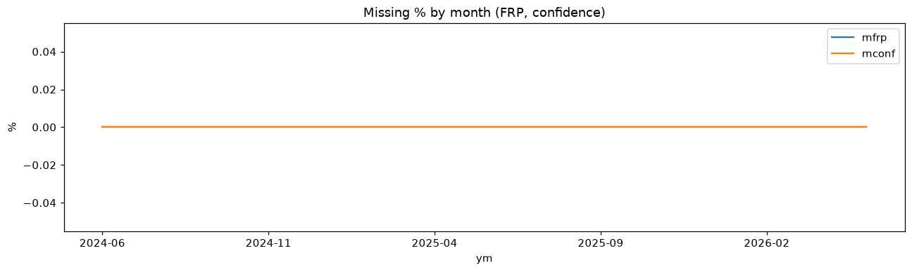

- Missingness 0% for FRP/confidence in every month — no pipeline gaps.
- Duplicates: 0 exact / 1 event-key; near-duplicates intentionally left for persistence stage (§4).

## 6. Persistence preview (§19 — directly feeds your features)

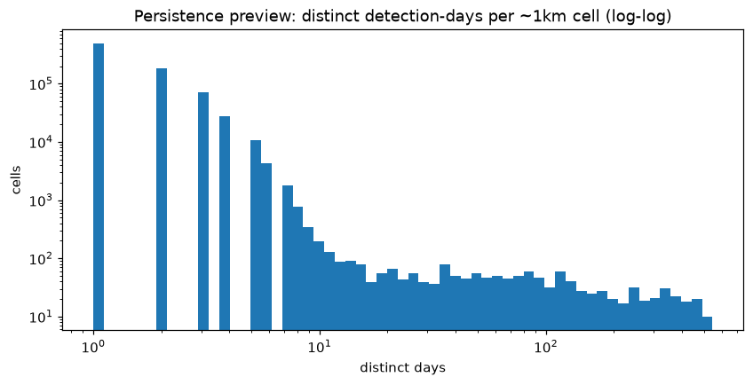

- 794,698 distinct ~1 km cells; median 1 distinct day, mean 1.79, max 546 days.
- **1,869 cells with ≥10 distinct days; 995 cells with ≥30 distinct days** → candidate persistent-source pool for Milestone 5/8.
- Next step: tolerance-based recurrence + OSM overlay (§20), but **never** label `nearest industry = industrial fire` (§21).

## 7. ML-readiness / leakage notes (§21, §26–§29)

- Single satellite (N20) + single version (2) → **no sensor/version bias possible inside this file** (§28 satisfied trivially); re-check when you add S-NPP/NOAA-21 or NRT.
- No labels yet → §25 class EDA and §26 leakage checks run after labeling; keep persistence features strictly causal (no post-event observations, §27).
- Seasonal structure is strong → evaluate same-month-across-years and hold out whole time blocks, not just random rows (§29).

## 8. How to re-run

```bash
python ml/scripts/eda_firms_24mo.py
# outputs → eda/outputs/*.png, audit.json, correlations.csv
```
