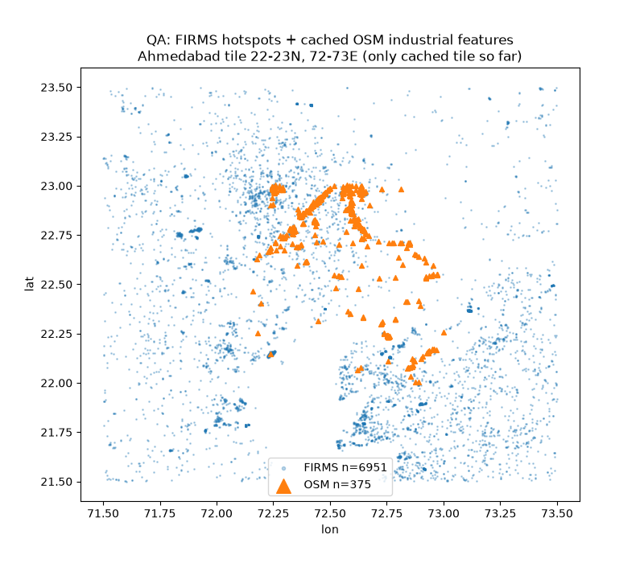
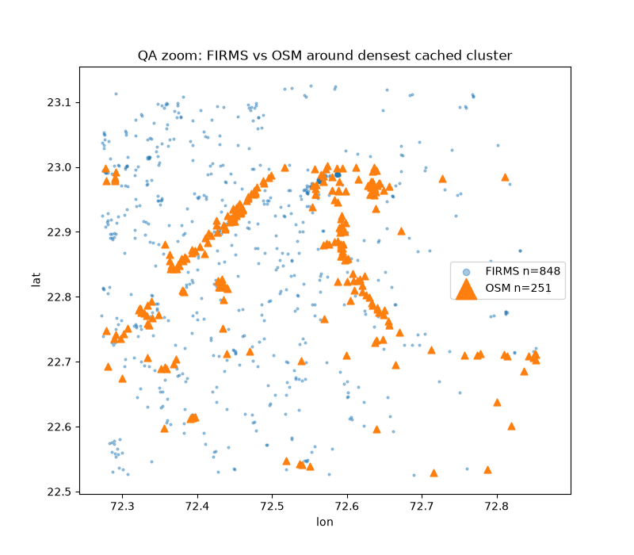

# OSM Enrichment QA — FIRMS × Industrial Context (no labels)

**Script:** `ml/scripts/enrich_firms_with_osm.py`
**Input:** 24-month FIRMS CSV (1,891,825 rows, untouched) + `data/raw/osm/*.parquet`
**Output:** `data/processed/firms_osm_enriched.parquet` (31 cols: 18 FIRMS + 12 enrichment + `label`)
**Maps:** `eda/plot_enrichment_qa.py` → `outputs/18_enrich_qa_tile.png`, `outputs/19_enrich_qa_zoom.png`

## QA numbers (2026-09-15 run, 375 cached OSM features / 1 tile)

| Metric | Value |
|---|---|
| Total FIRMS records | 1,891,825 |
| Records with OSM ≤ 5 km | 1,427 |
| No OSM within 5 km | 1,890,398 |
| Median nearest distance | 1,043 km |
| Mean / p90 nearest | 1,232 / 2,321 km |
| With power plant ≤ 5 km | 273 |
| With quarry / flare / petro-well ≤ 5 km | 0 / 0 / 0 |
| Industrial land-use ≤ 2 km | 678 |
| Labels assigned | none — `label=UNKNOWN` on all 1,891,825 rows |

Nearest-type leaders: `landuse:industrial` 1.13M, `man_made:works` 456k, `power:plant` 306k.

## Reading this correctly

- Coverage is thin because only 1 tile of 240 is cached — the 1,427 matched rows are the honest yield so far, not a model signal. Re-run enrichment after the full download; counts will change, code won't need to.
- Median nearest (1,043 km) is a cache-completeness metric, not a finding.
- Even FRP 11.68 MW at 2.6 km from industry stays `UNKNOWN`: context describes surroundings, never the cause.

## Maps

Geographically sensible: OSM follows the Ahmedabad–Vadodara corridor; FIRMS overlaps there plus rural background. More regions mappable via `--plot` areas once cached.

## Known limitation (deferred, tracked)

Ways → centroids. A hotspot inside a big refinery polygon but off-centroid reads as distant. Baseline-OK. Upgrade path (no re-download needed): use stored `nearest_osm_id`/`kind` + `tags` to fetch polygon geometry → point-in-polygon / distance-to-boundary.
